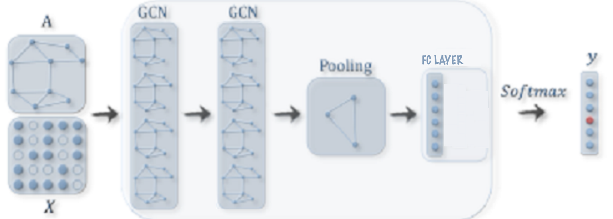

## GCN Graph Level Classification on CYCLE dataset.

The GCN model used follows the following architecture with an added pooling layer and a FC layer at the end.

<p align="center"> 

</p>

### Training Visualization

<p align="center">

</p>
<p align="center">
<em>Representation Space of the graph embeddings learnt over 400 epochs</em>
</p>

The predicted outputs from the Python forward pass and C++ forward pass are saved in `resources/saved/`. As expected, they are almost identical and the similarity between both can be seen quantitatively as well visually with scatter plots in `Cycle_Compare_Predictions.ipynb`.

## Usage
### Step 1

```
# Clone the repository
git clone https://github.com/AnirudhDagar/MessagePassing_for_GNNs.git
```

### Step 2
```
# Train the model and save the weights.
python Train_Cycles.py

```

### Step 3
```
# Use a compiler directly to compile the executables.
g++ main.cpp -I eigen -std=c++17

```
