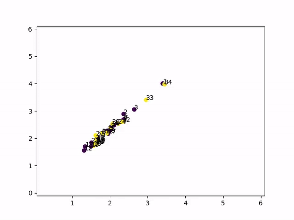

# Message Passing GNNs C++

My experiments with Graph Neural Nets at the scratch level using C++. Graph Convolutional Network (GCN) is one of the most popular GNN architectures and is extremely powerful. Of the popular graph representation learning methods which can be found at [https://github.com/dsgiitr/graph_nets](https://github.com/dsgiitr/graph_nets), this repo aims to implement GCNs in C++.

## GCN C++ Forward Pass

This is a C++ implementation using [Eigen](http://eigen.tuxfamily.org/index.php?title=Main_Page) for the **forward pass** of **Graph Convolutional Neural Networks** . The model doesn't involve any training loops and backpropagation. Pytorch is used to train the GCN model in Python and save the weights learnt after convergence. These saved weights are then imported and used in the C++ implementation of the model for the forward pass on the same dataset. 

The GCN architecture and PyTorch implementation are explained in this [blog](https://dsgiitr.com/blogs/gcn/) are followed. The network is a 2 layer gcn model.

### Training Visualization



The predicted outputs from the Python forward pass and C++ forward pass are saved in `resources/saved/`. As expected, they are almost identical and the similarity between both can be seen quantitatively as well visually with scatter plots in `Compare_Predictions.ipynb`.

## Usage
### Step 1

```
# Clone the repository
git clone https://github.com/AnirudhDagar/MessagePassing_for_GNNs.git

# Download the Karate Club Dataset
bash ./get_karate_club.sh
```

### Step 2
```
# Train the model and save the weights.
python train.py

```

### Step 3
```
# Use the CMakeLists.txt to build and run the project for C++ implementation.

# In the source directory
mkdir _build

# Change dir into _build
cd _build

# Build the project
cmake ..
make
```

#### OR
```
# Use a compiler directly to compile the executables.
g++ main.cpp -I eigen -std=c++17

```

### Run at Once
```
# Run everything at once.
bash run.sh

```


### Requirements

```
# C++
eigen

# Python
numpy==1.18.1
torch==1.0.0
ConfigArgParse==0.13.0
matplotlib==3.0.1
imageio==2.4.1
celluloid==0.2.0

```

## Contributing
Pull requests are welcome. For major changes, please open an issue first to discuss what you would like to change.